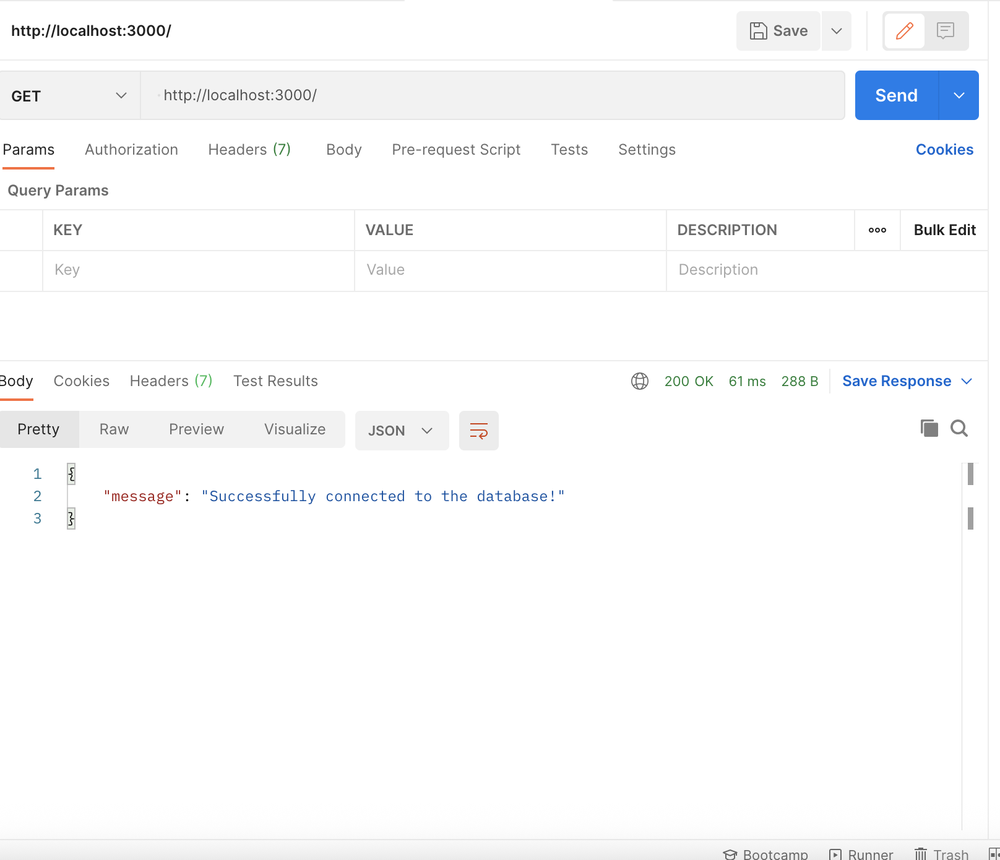

# 📱 Social Media API - MongoDB Connection
A backend foundation built with Node.js, Express, and MongoDB Atlas. This project demonstrates how to securely connect a cloud-hosted NoSQL database to a RESTful API.

## 🛠 Features
**Cloud Database Integration:** Uses MongoDB Atlas for scalable data storage.

**Environment Security:** Protects sensitive database credentials using dotenv.

**Asynchronous Connection:** Implements async/await for robust database handshakes.

## 🚀 Installation & Setup
**1. Clone & Install**
```Bash
# Create and enter the directory
mkdir social-media-api
cd social-media-api

# Initialize and install dependencies
npm init -y
npm install express mongodb dotenv
```
**2. Database Configuration**
Log in to MongoDB Atlas.

Create a cluster (M0 Free Tier).

Add a Database User and whitelist your IP (or use 0.0.0.0/0).

Copy your Connection String.

**3. Environment Variables**
Create a .env file in the root directory:

```code snippet
PORT=3000
MONGO_URI=mongodb+srv://<username>:<password>@cluster.mongodb.net/socialDB?retryWrites=true&w=majority
```
Note: Replace <password> with your actual database user password.

## 🚦 How to Run
Start the server using Node:

```bash

node server.js
```
You should see two success messages in your terminal:

✅ Connected successfully to MongoDB

🚀 Server is running on ```http://localhost:3000```



### Reflection Questions 

***Why is it important to whitelist IP addresses in a real-world production environment? What are the risks of allowing connections from anywhere (0.0.0.0/0)?**

In production, your database is your most valuable asset. Whitelisting creates a "firewall" that only allows trusted servers (like your App Server or your office IP) to even attempt a connection. It adds a layer of security before a password is even checked.The risk of allowing connections from anywhere is you can make your site subject to malicious activity.

**What is the purpose of the dotenv package? What other methods could you use to manage environment variables in a production environment (e.g., in a cloud hosting service)?**


Its primary job is security and portability. It ensures that sensitive secrets (API keys, DB passwords) are not hard-coded into your source code, which prevents them from being accidentally pushed to GitHub.


***If your application failed to connect, what are the first few steps you would take to debug the issue?**
1. Check the URI String
2. Verify Network Access
3. Check the dotenv Load